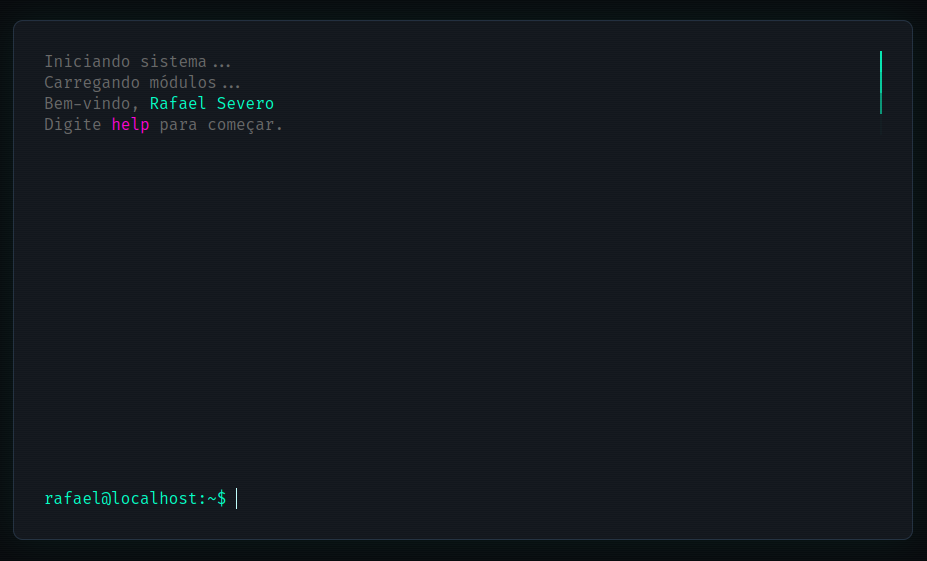
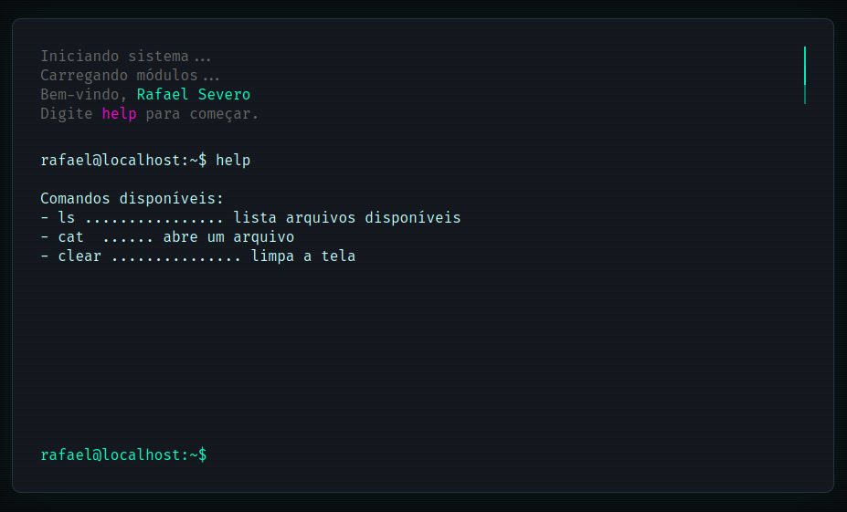
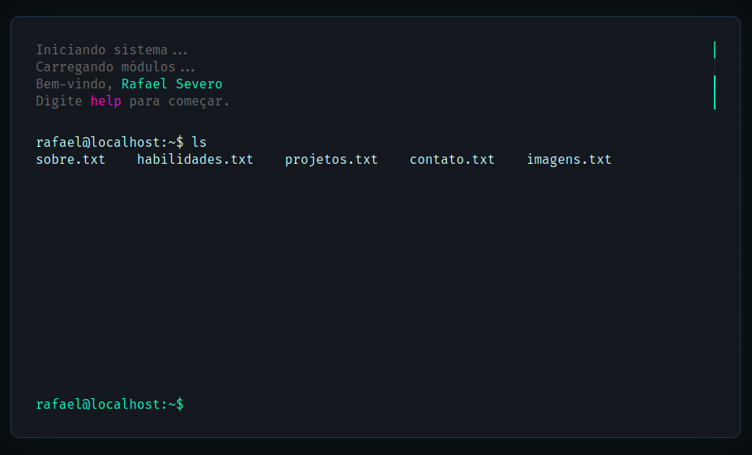

# Portfólio Interativo em Forma de Terminal

Este projeto é uma abordagem criativa e interativa para um portfólio pessoal, simulando a interface de um terminal de linha de comando. Através de comandos simples, os visitantes podem navegar pelas minhas informações, habilidades, projetos e formas de contato.

## 🚀 Sobre o Projeto

A ideia central foi criar uma experiência de usuário única e memorável, afastando-se dos layouts de portfólio tradicionais. O ambiente de terminal oferece uma forma divertida e nostálgica de apresentar meu trabalho como desenvolvedor.

## ✨ Funcionalidades

* **Interface de Terminal:** Um design limpo e inspirado em terminais clássicos.
* **Animação de "Boot":** Uma sequência de inicialização animada para dar as boas-vindas.
* **Comandos Interativos:** Navegue pelo conteúdo usando comandos como `ls`, `cat`, e `help`.
* **Conteúdo Estruturado:** As seções são apresentadas como "arquivos" dentro do terminal, tornando a exploração intuitiva.


## 💻 Comandos Disponíveis

Use os seguintes comandos para explorar o portfólio:

* `help` - Mostra a lista de comandos disponíveis.
* `ls` - Lista todos os arquivos que você pode visualizar.
* `cat <arquivo>` - Exibe o conteúdo de um arquivo. (Ex: `cat sobre.txt`).
* `clear` - Limpa o histórico de comandos da tela.



### Arquivos para explorar:

* `sobre.txt`
* `habilidades.txt`
* `projetos.txt`
* `contato.txt`



## 🛠️ Tecnologias Utilizadas

Este projeto foi construído com tecnologias web essenciais, sem a necessidade de frameworks externos:

* **HTML5:** Para a estrutura semântica da página.
* **CSS3:** Para toda a estilização, incluindo o design do terminal, cores, fontes e animações.
* **JavaScript (Vanilla):** Responsável por toda a lógica de interatividade, manipulação de comandos e exibição de conteúdo.

## 🏃 Como Executar o Projeto

Por ser um projeto puramente front-end, você não precisa instalar nenhuma dependência.

1.  Clone este repositório:
    ```bash
    git clone [https://github.com/rafaeumesmo/Portfolio-em-forma-de-terminal.git](https://github.com/rafaeumesmo/Portfolio-em-forma-de-terminal.git)
    ```
2.  Navegue até o diretório do projeto.
3.  Abra o arquivo `index.html` em seu navegador de preferência.

## 📫 Contato

Vamos nos conectar!

* **GitHub:** [github.com/rafaeumesmo](https://github.com/rafaeumesmo)
* **LinkedIn:** [linkedin.com/in/rafaeumesmo](https://linkedin.com/in/rafaeumesmo)
